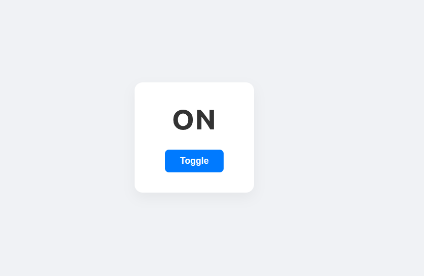

# Vanilla JS Toggle Application

<p align="center">
  
</p>

A lightweight, interactive mini-application designed to practice clean Document Object Model (DOM) manipulation, event handling, and dynamic styling workflows using vanilla JavaScript, HTML5, and CSS3.

## 🚀 Features

- **Dynamic State Switching:** Listens for active mouse click events and instantly alternates component states between "ON" and "OFF".
- **Tactile UI Transitions:** Includes interactive CSS micro-interactions, such as a physical scale bounce (`scale(0.96)`) when the button element is physically pressed.
- **Clean Component Separation:** Strict separation of structural layout (`Toggle.html`), visual styles (`Toggle.css`), and functional logic (`Toggle.js`).

## 📁 File Architecture

```text
toggle-app/
├── Toggle.html  # Semantic structural mockup
├── Toggle.css   # Modern centered flexbox styles
└── Toggle.js    # Event listeners and DOM text manipulation

🛠️ Implementation Details

The core functionality targets elements dynamically using native browser APIs:

    document.getElementById() to cache text and button structures safely without resource overhead.

    .addEventListener("click", ...) to capture and process instant user input loops.

    Conditional logic (if/else) to track and mutate the internal layout content state seamlessly.

💻 How to Run

    Open the project folder on your local file manager.

    Double-click Toggle.html to execute the code instantly inside any modern web browser.